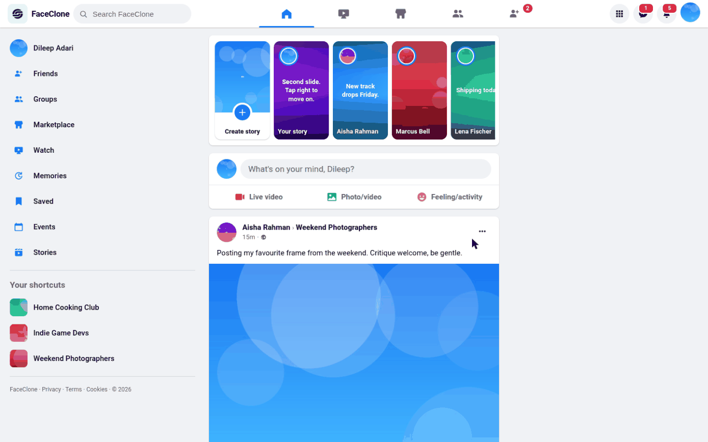
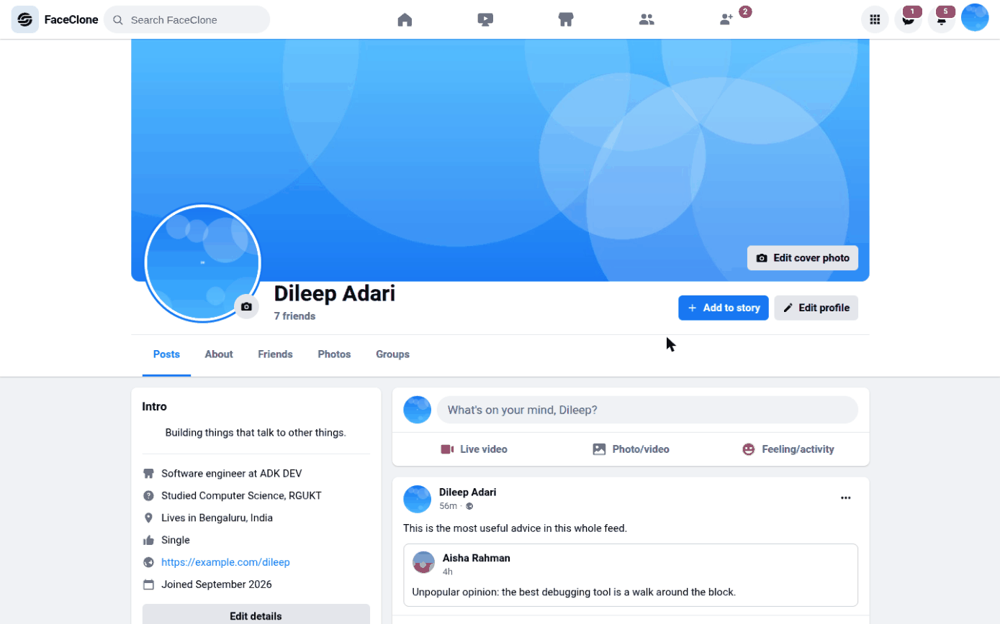
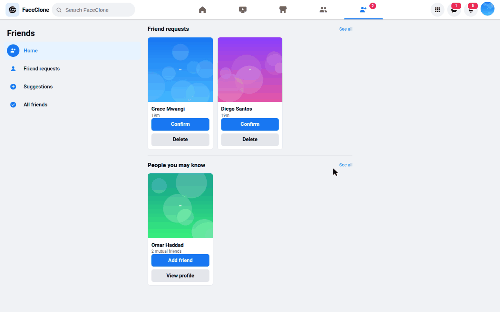
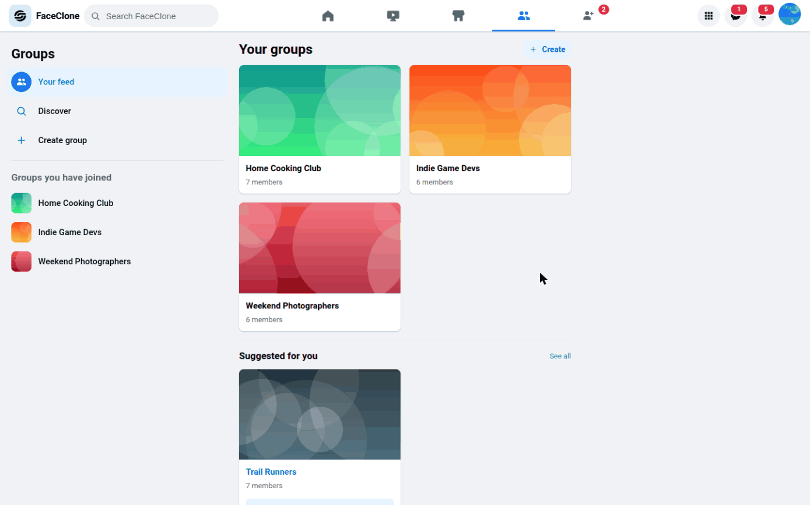
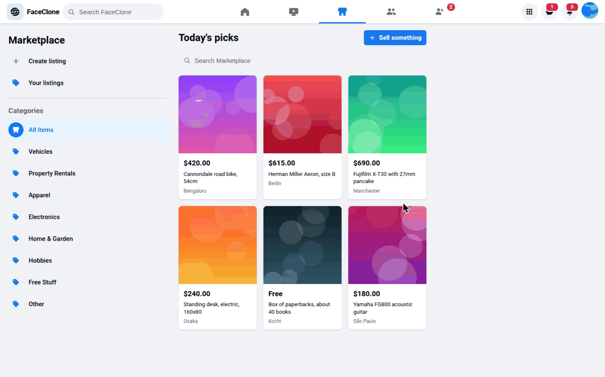
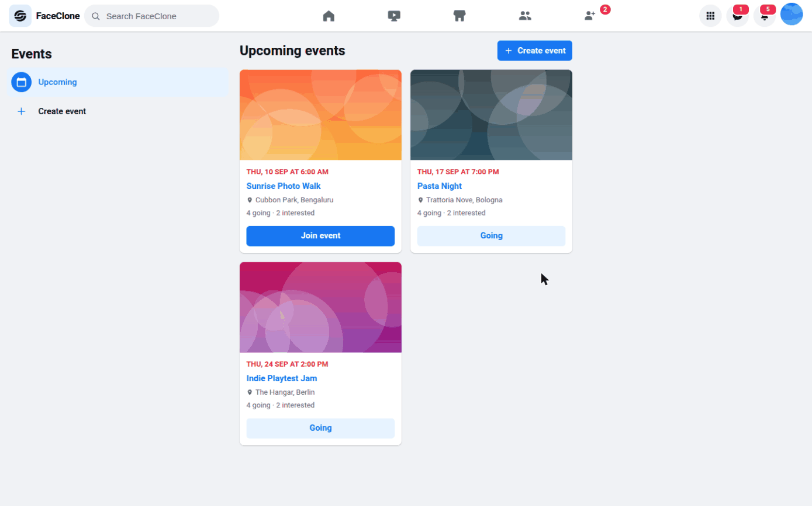
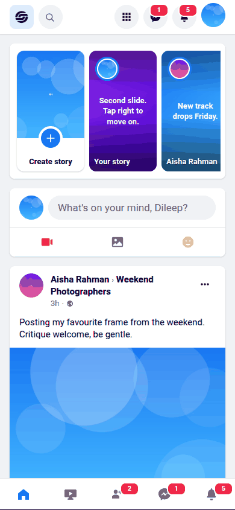
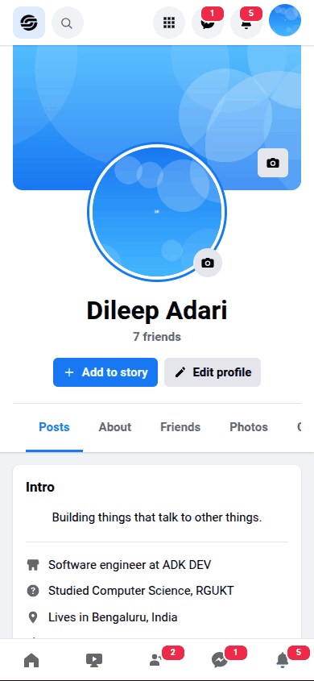
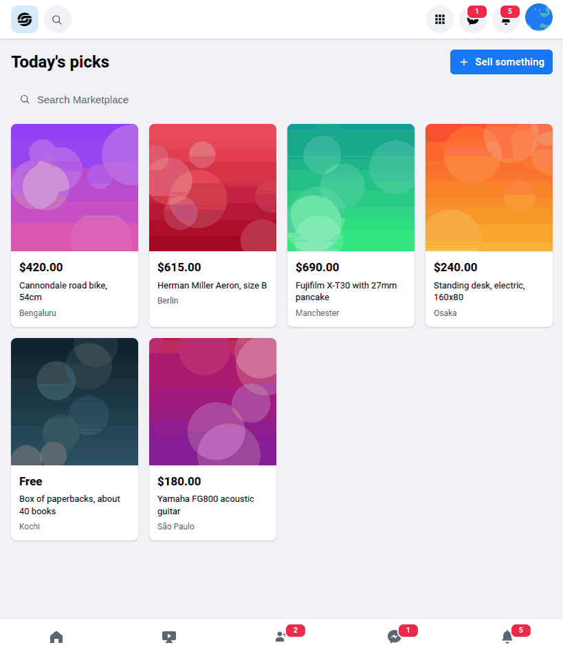

<!-- Generated from README.md by scripts/build-light-readme.php. Do not edit by hand. -->

<div align="center">

<picture>
  <source media="(prefers-color-scheme: dark)" srcset="./docs/assets/adk_dev_logo_light.png">
  
</picture>

# FaceClone

**A social network you can run on your own machine: posts, stories, reactions, comments, friends, groups, messaging, marketplace and events, wired end to end against a real database with no mocked data.**


<br>


<br><br>

**[Developer documentation](./DEVDOC.md)** · [Features](#features) · [Getting started](#getting-started)

<p><b>Light mode</b> · <a href="./README.md">View this page in dark mode</a></p>

</div>

---

## Contents

- [Why this project matters](#why-this-project-matters)
- [Screenshots](#screenshots)
- [Responsive layout](#responsive-layout)
- [Features](#features)
- [The post lifecycle](#the-post-lifecycle)
- [Getting started](#getting-started)
- [Contributors](#contributors)
- [Contributing](#contributing)
- [License](#license)

---

## Why this project matters

Cloning a social network's *look* is a weekend. Cloning what makes one hard is not, and
that is the part this is for.

The hard part is that **visibility is a per-viewer question asked on every read**. A post
has an audience, its author has a default, the group it was posted to has its own rules,
and the person reading it may be a friend, a friend of a friend, a group member, or nobody.
Cache that decision and you leak. So it is decided at read time, every time: changing a
post's audience takes effect for every reader immediately.

The second hard part is that nothing here is a stub. Uploads write real files with real
MIME checks and real size limits. Reactions, comments, shares, stories that expire, group
membership, marketplace listings and message threads all sit in a real schema with real
foreign keys. There are no fixtures pretending to be a backend, which means the awkward
cases (deleting a post that has been shared, a story that expires mid-session, a friend
request from someone who already blocked you) have to actually be handled.

And it is built with **no framework and no Composer dependencies at all**: a hand-written
router, a small PDO layer, plain PHP views. That is a deliberate constraint. It means every
piece of behaviour is visible in this repository rather than delegated to a package, which
is the only reason a codebase like this is worth reading.

## Screenshots

Every image is a real 1440x900 viewport render against the seeded demo data. This page shows **light mode**; the same gallery in dark mode is at **[README.md](./README.md)**.

<table>
  <tr>
    <td width="33%" valign="top">
      
      <p align="center"><b>Feed</b><br><sub>Stories, composer, and posts filtered by audience.</sub></p>
    </td>
    <td width="33%" valign="top">
      
      <p align="center"><b>Profile</b><br><sub>Cover, intro, and the tabs for friends, photos and groups.</sub></p>
    </td>
    <td width="33%" valign="top">
      
      <p align="center"><b>Friends</b><br><sub>Requests, suggestions by mutuals, and the full list.</sub></p>
    </td>
  </tr>
  <tr>
    <td width="33%" valign="top">
      
      <p align="center"><b>Groups</b><br><sub>Membership drives who can see what was posted where.</sub></p>
    </td>
    <td width="33%" valign="top">
      
      <p align="center"><b>Marketplace</b><br><sub>Listings by category, with prices and locations.</sub></p>
    </td>
    <td width="33%" valign="top">
      
      <p align="center"><b>Events</b><br><sub>Going and interested, counted per event.</sub></p>
    </td>
  </tr>
</table>

## Responsive layout

Each image is a single render at that exact viewport, not a scaled-down desktop shot.

<table>
  <tr>
    <td width="28%" valign="top">
      
      <p align="center"><b>Phone, 390x844</b><br><sub>The rails collapse and navigation moves to a bottom bar.</sub></p>
    </td>
    <td width="28%" valign="top">
      
      <p align="center"><b>Phone, profile</b><br><sub>Cover, avatar and actions stack into one column.</sub></p>
    </td>
    <td width="44%" valign="top">
      
      <p align="center"><b>Tablet, 820x950</b><br><sub>The sidebar gives way and listings widen to four columns.</sub></p>
    </td>
  </tr>
</table>

## Features

### Feed and posts
- Write a post with text, up to eight photos or videos, a feeling and a location
- Put a short text post on one of eight gradient backgrounds, the way Facebook does
- Pick an audience per post: Public, Friends, or Only me
- React with any of the seven reactions; hover the Like button to open the reaction picker
- Comment, reply to a comment, react to a comment, edit and delete your own
- Share a post to your own timeline with your own commentary attached
- Save a post to read later, and delete or edit anything you wrote
- The feed loads more posts as you scroll, without a page change

### Stories
- Post a photo story, or a text story on a gradient background
- Stories expire 24 hours after posting and disappear from every tray automatically
- The story viewer runs timed progress bars, advances on its own, and chains from one
  person to the next; tap either side to step back and forward
- Your own stories show how many people have seen them

### Profile
- Cover photo and profile photo, both replaceable in place
- Intro panel: bio, work, education, current city, hometown, relationship, website
- Tabs for posts, about, friends, photos and groups
- Followers and following lists

### Friends
- Send, cancel, accept and decline friend requests
- Unfriend, follow without friending, and block
- People You May Know, ranked by how many friends you have in common
- Blocking is symmetric: a blocked person disappears from your feed, search and profile,
  and any existing friendship is removed

### Groups
- Create a public or private group with a cover photo and description
- Public groups let anyone join instantly; private groups queue a request for an admin
- Post inside a group, invite friends, review join requests
- Admin, moderator and member roles, with an admin able to promote, demote or remove
- The last admin cannot leave without the group being handed to someone else

### Messenger
- One conversation per pair, created the first time you message someone
- Send text and photo attachments; new messages arrive without a reload
- Unread badges in the top bar and per conversation, and an active-now indicator

### Notifications
- Reactions, comments, replies, friend requests, shares, group activity and messages
- A dropdown in the top bar and a full page, both with read/unread state
- Every notification type can be switched off in settings, which stops it being created

### Search
- Typeahead in the top bar, plus a results page split into people, posts and groups
- Hashtags and @mentions in post text are linked and searchable

### Marketplace and events
- List an item with a price, category, location and photo; mark it sold or delete it
- Message a seller directly from a listing
- Create events, RSVP as going or interested, and see who else is attending

### Settings
- Account: name, username, email, password, deactivate, delete
- Privacy: default post audience, who can friend you, who can message you, activity status
- Notifications: a switch per notification type
- Display: light, dark, or follow the system
- Blocking: see and undo everyone you have blocked

## The post lifecycle

A post moves through a small set of states rather than a workflow:

1. **Composed** in the dialog, with an audience chosen up front
2. **Published**, visible to whoever the audience allows, and to nobody else
3. **Edited**, which keeps the original timestamp and marks the post as edited
4. **Shared** by someone else, which creates a new post pointing at the original
5. **Deleted**, which removes its media, comments and reactions with it

Visibility is decided at read time, never cached. Changing a post's audience takes effect
for every reader immediately, and a post in a group is visible to that group's members
regardless of the author's default audience.

## Getting started

PHP 8.1 or newer with `pdo_mysql`, `gd`, `mbstring` and `fileinfo`, plus MariaDB or MySQL.
No framework, no Composer, no build step, nothing to install but the database.

```bash
php bin/console.php doctor          # extensions, permissions and the connection
php bin/console.php install --seed  # schema and demo data
php -S localhost:8000 -t public server.php
```

`server.php` is not optional: it is the router the built-in server needs. See
[DEVDOC.md](./DEVDOC.md) for why.

Then sign in as `dileep@faceclone.test` with password `password123`. Every seeded
account uses the same password, and `.test` is a reserved domain, so none of them
is a real address.

Database credentials come from `config/config.example.php`, overridden by
`config/config.local.php` (git-ignored) and then by `FACECLONE_*` environment
variables. Full setup is in [DEVDOC.md](./DEVDOC.md#local-development).

## Contributors

<table>
  <tr>
    <td align="center">
      <a href="https://github.com/Dileepadari">
        
        <br><sub><b>Dileep Adari</b></sub>
      </a>
      <br><sub>Author and maintainer</sub>
    </td>
  </tr>
</table>

## Contributing

Issues and pull requests are welcome at
[github.com/Dileepadari/FaceClone](https://github.com/Dileepadari/FaceClone).

Before opening a pull request:

```bash
git ls-files '*.php' | xargs -n1 php -l
php bin/console.php doctor
php bin/console.php install --seed --force
```

CI runs the same on PHP 8.1 and 8.3 against a real MariaDB, then boots the app and
asserts that a page renders, that `HEAD` works, that a wrong verb answers 405, and
that the security headers are still being sent. Please keep commit messages to a
single line.

## License

GPL-3.0. See [LICENSE](./LICENSE).

This is copyleft, not permissive: anything you distribute that is built from this
has to be GPL-3.0 too. That is a deliberate difference from the MIT projects in
this account, so check it is what you want before you fork.
